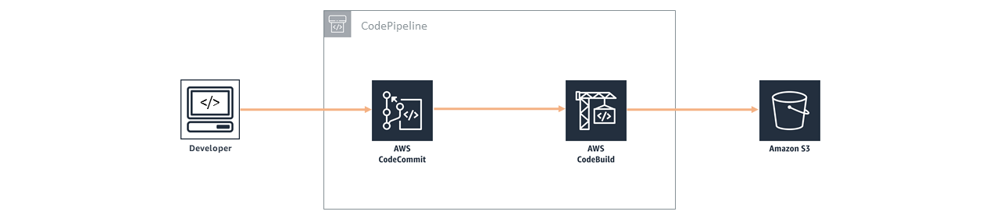

## Jockey

Jockey is a full-fledged sample web application that creates a simple CRUD (create, read, update, delete) app, and provides the foundational services, components, and plumbing needed to get a basic web application up and running. **[Try out the deployed application here](https://jockey.bekta.ch)**!

This boilerplate was inspired by, adapted to Terraform and modified from following sources:
**[Serverless Stack](https://serverless-stack.com/)**
**[AWS Full Stack Template](https://github.com/awslabs/aws-full-stack-template/)**

## License Summary

This sample code is made available under a modified MIT license. See the LICENSE file.

&nbsp;

## Outline

- [Overview](#overview)
- [Architecture](#architecture)

&nbsp;

## Overview

The goal of Jockey is to provide a fully-functional web application that helps users accelerate building apps on AWS by providing an out-of-the-box boilerplate. This boilerplate is adapted to Terraform IaC language and is pre-loaded with best practices. 

The boilerplate includes the following components:

**Database components**

* Pokemon list – Amazon DynamoDB offers fast, predictable performance for the key-value lookups needed in the pokemon app, and enormous scale so you can build on top of it.

**Application components**

* Serverless service backend – Amazon API Gateway powers the interface layer between the frontend and backend, and invokes serverless compute with AWS Lambda.  
* Web application blueprint – We include a React web application pre-integrated out-of-the-box with best practices and tools such as React Bootstrap, React Router, Typescript, and more.

**Infrastructure components**

* Continuous deployment code pipeline – AWS CodePipeline and AWS CodeBuild help you build, test, and release your application code.
* Serverless web application – Amazon CloudFront and Amazon S3 provide a globally-distributed application.

You can choose to customize this boilerplate to create your own pokemon app, modify and improve this one, or add onto it to make a completely different type of web application.

&nbsp;

---

&nbsp;

## Architecture

**Summary diagram**

&nbsp;

**High-level, end-to-end diagram**

&nbsp;

**Frontend**

Build artifacts are stored in a S3 bucket where web application assets are maintained (web graphics, etc.). Amazon CloudFront caches the frontend content from S3, presenting the application to the user via a CloudFront distribution.  The frontend interacts with Amazon Cognito and Amazon API Gateway only.  Amazon Cognito is used for all authentication requests, whereas API Gateway (and Lambda) is used for all API calls to DynamoDB.

**Backend**

The core of the backend infrastructure consists of Amazon Cognito, Amazon DynamoDB, AWS Lambda, and Amazon API Gateway. The application leverages Amazon Cognito for user authentication, and Amazon DynamoDB to store all of the data for the pokemons.

&nbsp;

**Developer Tools**

The code is hosted in AWS CodeCommit. AWS CodePipeline builds the web application using AWS CodeBuild. After successfully building, CodeBuild copies the build artifacts into a S3 bucket where the web application assets are maintained (web graphics, etc.). Along with uploading to Amazon S3, CodeBuild invalidates the cache so users always see the latest experience when accessing the storefront through the Amazon CloudFront distribution.  AWS CodeCommit. AWS CodePipeline, and AWS CodeBuild are used in the deployment and update processes only, not while the application is in a steady-state of use.

